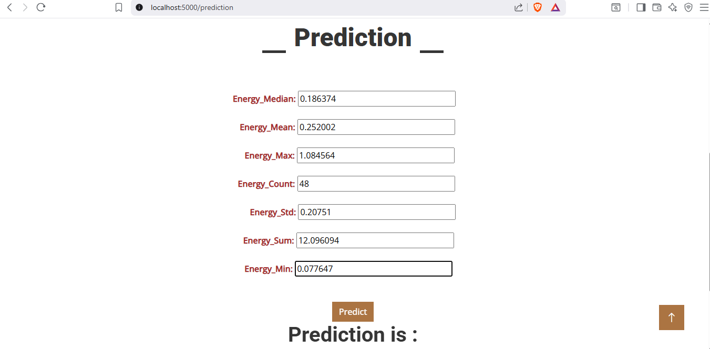
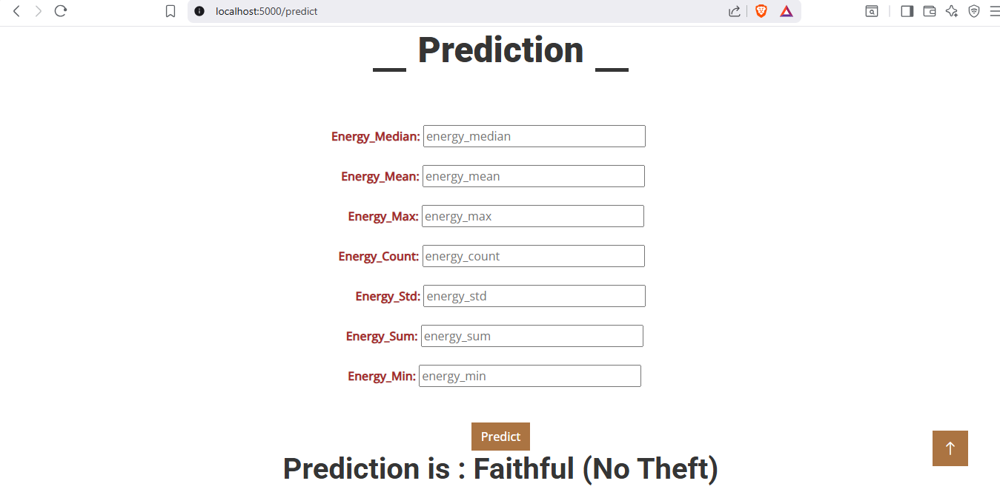
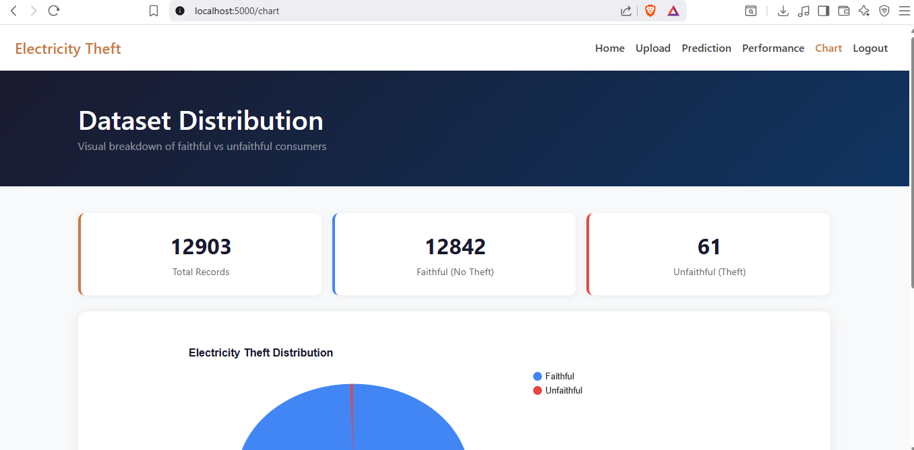
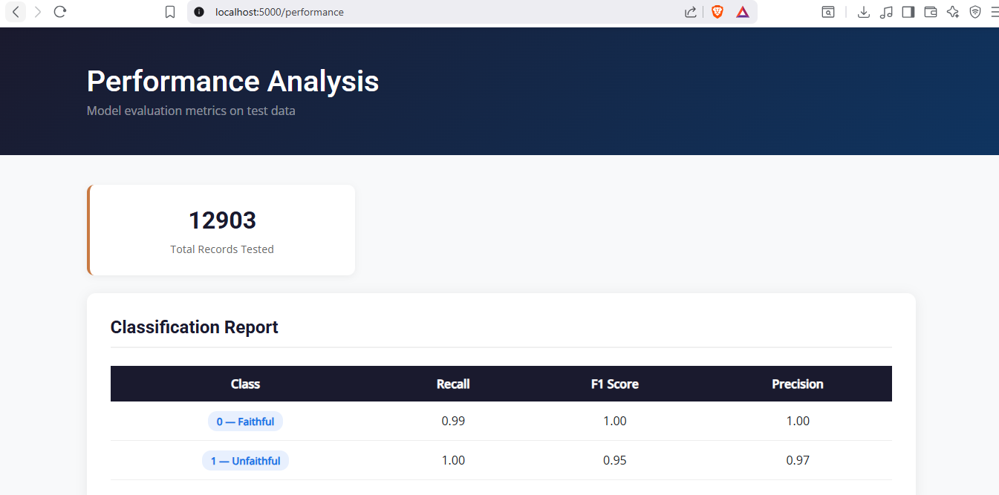

# Electricity Theft Detection in Smart Grids using Deep Neural Network

A machine learning web application that detects fraudulent electricity usage patterns in smart grids using a Deep Neural Network (DNN). Built as a Final Year Bachelor's Project.

---

## Problem Statement

Electricity theft is a major global issue causing billions of dollars in losses annually for utility companies. Traditional rule-based detection methods are slow and inaccurate. This project uses a **Deep Neural Network trained on smart meter energy consumption data** to automatically classify consumers as faithful or unfaithful — achieving **99% accuracy**.

---

## Model Architecture

| Component | Detail |
|---|---|
| Algorithm | Artificial Neural Network (ANN / DNN) |
| Clustering | Agglomerative Clustering (k=3) to label theft |
| Scaler | StandardScaler (saved as `StandardScaler.pk`) |
| Training Accuracy | 99% |
| Validation Accuracy | 99% |
| Output | Binary classification — Faithful (0) / Unfaithful (1) |

**Input features:**
- `energy_median`, `energy_mean`, `energy_max`
- `energy_count`, `energy_std`, `energy_sum`, `energy_min`

---

## Web Application

Built with **Flask** — upload a smart meter dataset and the system will:

- Preview the uploaded dataset
- Predict theft for individual consumers
- Show faithful vs unfaithful distribution chart
- Display confusion matrix and performance metrics live from the model

> **Demo credentials:** Username: `admin` · Password: `admin`
> _(This is a demo application — authentication is hardcoded for demonstration purposes only)_

### Screenshots

#### Home Page

The landing page introduces the project, displays key model metrics (99% accuracy), and explains the three-step workflow: upload data → run prediction → view results.

#### Prediction — Input

The prediction form takes seven energy consumption features as input — median, mean, max, count, standard deviation, sum, and minimum — and runs them through the trained DNN in real time.

#### Prediction — Result

The model outputs either **Faithful** (no theft detected) or **Unfaithful** (theft detected) based on the input energy pattern.

#### Dataset Distribution Chart

After uploading a dataset, this pie chart shows the proportion of faithful vs unfaithful consumers detected by the model. Values update dynamically based on the uploaded data.

#### Performance Analysis

Displays the classification report (Precision, Recall, F1 Score) and a confusion matrix generated live by running the uploaded dataset through the trained model — not a static image.

---

## How to Run Locally

### Prerequisites
- Python 3.8+
- pip

### Steps

```bash
# 1. Clone the repository
git clone https://github.com/mohammaditabassumkhatib-oss/Electricity_Theft_Detection_using_DNN.git
cd Electricity_Theft_Detection_using_DNN

# 2. Create and activate a virtual environment
python -m venv venv

# Windows
venv\Scripts\activate

# Mac/Linux
source venv/bin/activate

# 3. Install dependencies
pip install -r requirements.txt

# 4. Run the app
python app.py
```

Then open your browser and go to: **http://127.0.0.1:5000**

Log in with username `admin` and password `admin`.

---

## Project Structure

```
Electricity_Theft_Detection_using_DNN/
│
├── notebooks/
│   └── model.ipynb               # DNN training notebook — data prep, clustering, model training
│
├── templates/                    # Flask HTML pages
│   ├── index.html                # Landing page
│   ├── login.html                # Login page
│   ├── upload.html               # Dataset upload
│   ├── preview.html              # Dataset preview table
│   ├── prediction.html           # Record prediction
│   ├── chart.html                # Distribution pie chart
│   └── performance.html          # Confusion matrix + metrics
│
├── static/
│   ├── css/                      # Custom stylesheets
│   ├── js/                       # Custom JavaScript
│   └── img/                      # App images and screenshots
│
├── data/
│   └── test_data.csv             # Sample labelled dataset (6 records)
│
├── paper/
│   └── Electricity_Theft_Detection_Paper.pdf  # Research paper
│
├── app.py                        # Flask backend — all routes and model logic
├── theft.h5                      # Trained DNN model weights
├── StandardScaler.pk             # Fitted StandardScaler for input normalisation
├── requirements.txt              # Python dependencies
└── .gitignore
```

---

## Performance Results

| Metric | Class 0 (Faithful) | Class 1 (Unfaithful) |
|---|---|---|
| Precision | 1.00 | 0.97 |
| Recall | 0.99 | 1.00 |
| F1 Score | 1.00 | 0.95 |

The confusion matrix is generated live on the Performance Analysis page by running the dataset through the trained model — it reflects real predictions, not hardcoded values.

---

## Research Paper

A research paper accompanies this project covering the full methodology, dataset preparation, clustering approach, DNN architecture, and results. See [`paper/`](./paper/) for the PDF.

---

## Tech Stack

- **Backend:** Python, Flask
- **ML/DL:** TensorFlow, Keras, scikit-learn
- **Data:** Pandas, NumPy
- **Visualisation:** Matplotlib, Google Charts
- **Frontend:** HTML, CSS, Bootstrap 5

---

## Notes

- If your uploaded dataset does not contain a `label` column, the app will run predictions using the trained model and display the distribution on the chart page. The confusion matrix on the performance page requires a labelled dataset to compare predictions against ground truth.
- The trained model (`theft.h5`) and scaler (`StandardScaler.pk`) are included in the repo and loaded automatically on startup — no retraining needed.
- A file named `uploaded_dataset.csv` is created automatically when you upload a dataset. This file is excluded from version control via `.gitignore`.
